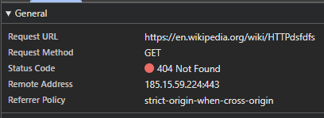

# Лабораторная работа №1. HTTP #

## Задание 1. Анализ HTTP-запросов. Часть 1 ##


### URL запроса ###

- ttps — протокол (HTTP поверх TLS, защищённое соединение)
- en.wikipedia.org — доменное имя сервера
- /wiki/HTTP — путь к конкретной странице на сервере

### Метод запроса ###

Request Method:

```sql
GET
```

Метод GET применяется для:

- получения (чтения) ресурса
- без изменения данных на сервере
- загрузки HTML-страни

### Статус ответа ###

Status Code: 200 OK

Это означает:

- запрос успешно обработан
- ресурс найден
- сервер вернул запрошенную страницу

Класс 200 относится к категории 2xx — успешные ответы

### Заголовки запроса и ответа ###

Заголовки запроса (Request Headers)

| Заголовок | Что означает |
| --------- | ----------- |
| Host | Домен сервера |
| User-Agent | Информация о браузере и ОС |
| Accept | Какие типы данных клиент готов принять |
| Accept-Language | Предпочитаемый язык |
| Accept-Encoding | Поддерживаемое сжатие (gzip, br и т.д.) |
| Connection | Тип соединения (keep-alive) |
| Cookie | Куки, если есть |

### Есть ли тело запроса или ответа? ###

Тело запроса

У метода GET обычно тела запроса нет, параметры передаются через URL (если есть)

В данном случае тело запроса отсутствует.

### Тело ответа ###

Да, тело ответа есть.

Оно содержит:

- HTML-код страницы Wikipedia
- встроенные ссылки
- текст статьи
- подключение CSS и JavaScript

Браузер получает этот HTML и отображает страницу.

### Какие ещё запросы были отправлены при загрузке страницы? ###

Я также заметила запросы на:

- CSS-файлы (грубо говоря стиль сайта: цвета, расположение)
- JS файлы (меню, поиск)
- Изображения и иконки
- Шрифты

### Анализ второго запроса ###



Метод запроса

```sql
GET
```

Статус ответа

Status Code:

```mathematica
404 Not Found
```

Код ответа HTTP 404 означает:

Сервер получил запрос, но не нашёл запрашиваемый ресурс.

То есть сервер работает, но страницы с таким адресом нет

## Задание 2. Анализ HTTP-запросов. Часть 2 ##

Метод запроса (Request Method)

```sql
GET
```

Метод GET применяется, потому что:

- поиск — это получение данных (страниц)
- запрос не изменяет данные на сервере
- результат можно сохранить в URL
- пользователь может поделиться ссылкой на поиск

Query Parameters (Параметры запроса)

| Параметр | Назначение |
| -------- | ---------- |
| search | поисковая строка пользователя |
| title | специальная страница поиска |
| profile | режим поиска (advanced) |
| fulltext | полнотекстовый поиск |
| ns0 | ограничение по типу страниц |
| advancedSearch-current | состояние расширенных фильтров |

## Задание 3. Анализ HTTP-запросов. Часть 3 ##

[https://www.google.com](https://www.google.com)

### Анализ запроса к Google ###

#### Метод запроса к Google ####

```sql
GET
```

Метод GET используется для загрузки главной страницы поиска.

#### Статус ответа Google ####

Status Code: 200 OK (иногда 301/302 редиректы)

- 200 OK — страница успешно загружена
- 301/302 — перенаправление (например, с http на https)

#### Заголовки запроса ####

| Заголовок | Значение |
| --------- | -------- |
| Host | `www.google.com` |
| User-Agent | Информация о браузере и ОС |
| Accept-Language | Предпочитаемый язык |
| Cookie | Данные сессии и предпочтения |

#### Заголовки ответа ####

Содержат информацию о:

- типе контента (text/html)
- политике безопасности (Content-Security-Policy)
- cookies для сохранения состояния
- кэшировании ресурсов

#### Тело запроса ####

Отсутствует (метод GET не передаёт данные в теле)

#### Содержимое ответа ####

Содержит HTML-код главной страницы Google:

- форма поиска
- логотип
- ссылки на сервисы
- CSS и JavaScript для интерактивности

## Задание 4. Составление HTTP-запросов ##

**Пример GET-запроса:**

```http
GET / HTTP/1.1
Host: sandbox.usm.com
User-Agent: Eva Beriozova
```

User-Agent — это HTTP-заголовок, который сообщает серверу:

- какая программа отправляет запрос
- какая ОС используется
- иногда — устройство пользователя

Используется для:

- адаптации сайта под браузер
- аналитики
- фильтрации ботов
- отладки запросов

### Пример POST-запроса ###

Пример POST-запроса (form-data):

```http
POST /cars HTTP/1.1
Host: sandbox.usm.com
Content-Type: application/x-www-form-urlencoded
User-Agent: Eva Beriozova

make=Toyota&model=Corolla&year=2020
```

POST используется, когда клиент создаёт новый ресурс на сервере.

Пример POST-запроса (JSON):

```http
POST /cars HTTP/1.1
Host: sandbox.usm.com
Content-Type: application/json
User-Agent: Eva Berezova

{
  "make": "Toyota",
  "model": "Corolla",
  "year": 2020
}
```

### Какие ещё методы HTTP существуют ###

| Метод | Назначение |
| ----- | ---------- |
| GET | получить ресурс (страницу, данные) |
| POST | создать новый ресурс |
| PUT | полностью заменить ресурс |
| PATCH | частично обновить ресурс |
| DELETE | удалить ресурс |

#### PUT-запрос ####

```http
PUT /cars/1 HTTP/1.1
Host: sandbox.usm.com
User-Agent: Eva Berezova
Content-Type: application/json

{
  "make": "Toyota",
  "model": "Corolla",
  "year": 2021
}
```

PUT означает:
обновить ресурс машины с id=1 полностью.

#### Разница между PUT и PATCH ####

PUT

- заменяет ресурс целиком
- требует отправки всех полей

PATCH

- изменяет только часть ресурса
- можно отправить одно поле

### Возможный ответ сервера на запрос ###

Возможный ответ сервера

```http
HTTP/1.1 400 Bad Request
Content-Type: application/json

{
  "error": "Invalid request body format. Expected JSON."
}
```

#### Когда сервер может вернуть коды 200, 201, 400, 401, 403, 404, 500 ####

200 OK -
Запрос выполнен успешно.

201 Created -
Ресурс успешно создан.

400 Bad Request -
Ошибка в запросе клиента.

401 Unauthorized -
Пользователь не авторизован.

403 Forbidden -
Доступ запрещён даже для авторизованного пользователя.

404 Not Found -
Ресурс не существует.

500 Internal Server Error -
Ошибка на стороне сервера.
