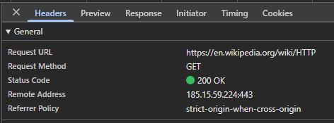

# Лабораторная работа №1. HTTP #
Based on the error MD047, you need to add a single newline character at the end of your file. Here's the corrected content for the `$SELECTION_PLACEHOLDER$` location:

```markdown
# Лабораторная работа №1. HTTP #

## Задание 1. Анализ HTTP-запросов. Часть 1 ##



### URL запроса ###

- ttps — протокол (HTTP поверх TLS, защищённое соединение)
- en.wikipedia.org — доменное имя сервера
- /wiki/HTTP — путь к конкретной странице на сервере

### Метод запроса ###

Request Method: GET

Метод GET применяется для:

- получения (чтения) ресурса
- без изменения данных на сервере
- загрузки HTML-страни

### Статус ответа ###

Status Code: 200 OK

Это означает:

- запрос успешно обработан
- ресурс найден
- сервер вернул запрошенную страницу

Класс 200 относится к категории 2xx — успешные ответы

### Заголовки запроса и ответа ###

Заголовки запроса (Request Headers)

| Заголовок | Что означает |
| --------- | ----------- |
| Host | Домен сервера |
| User-Agent | Информация о браузере и ОС |
| Accept | Какие типы данных клиент готов принять |
| Accept-Language | Предпочитаемый язык |
| Accept-Encoding | Поддерживаемое сжатие (gzip, br и т.д.) |
| Connection | Тип соединения (keep-alive) |
| Cookie | Куки, если есть |

### Есть ли тело запроса или ответа? ###

Тело запроса

У метода GET обычно тела запроса нет, параметры передаются через URL (если есть)

В данном случае тело запроса отсутствует.

### Тело ответа ###

Да, тело ответа есть.

Оно содержит:

HTML-код страницы Wikipedia

встроенные ссылки

текст статьи

подключение CSS и JavaScript

Браузер получает этот HTML и отображает страницу.
```

Ensure the file ends with exactly one newline character after the last line of content.