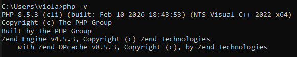
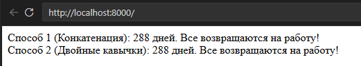

# Лабораторная работа №2. Установка и первая программа на PHP.
## Цель работы: установка и настройка среды разработки для работы с языком программирования PHP, а также создание первой программы на PHP.

### Практическая часть.

#### 1. Установка PHP.
   
Скачала архив с официального сайта, закинула на диск C 
Вот такая миленькая папочка: 


Дальше добавляем путь в переменные среды и проверяем все ли мы правильно сделали 



Терминал говорит нам, что все хорошо 
Значит идем дальше

#### 2. Написание первой PHP-программы.

Создаю файл index.php с таким содержимым:

```php
<?php
echo "Привет, мир!";
?>
```

Далее запускаю с помощью 

```php
php -S localhost:8000
```


#### 3. Вывод данных в PHP
   
Выведем строку "Hello, World!" используя echo и print:

```php
<?php
echo "Hello, World with echo!<br>"; 
print "Hello, World with print!";
?>
```

Обновила страницу: 


#### 4. Работа с переменными и выводом.

Создадим две переменные:

* Целочисленную переменную $days со значением 288.

   `$days = 288;`

* Строковую переменную $message с текстом: Все возвращаются на работу!.

   `$message = "Все возвращаются на работу!";`

Выведим значения переменных на экран несколькими способами:

* С использованием конкатенации.

```php
echo "Способ 1 (Конкатенация): " . $days . " дней. " . $message . "<br>";
```

* С использованием двойных кавычек.

```php
echo "Способ 2 (Двойные кавычки): $days дней. $message <br>";
```

Обновляем сайт:



#### Контрольные вопросы:

1. Установка PHP

* В составе сборки (XAMPP/WAMP/MAMP): Установка одним пакетом (PHP + Apache + MySQL)

* Ручная установка (Windows): Скачать ZIP с php.net, распаковать в C:\PHP и прописать путь в переменную PATH.

2. Проверка установки

Через командную строку:

```bash
php -v
```

3. Echo и Print

* Количество аргументов: echo может выводить несколько строк через запятую (echo "A", "B";), а print — только одну.
* Скорость работы: echo выполняется немного быстрее