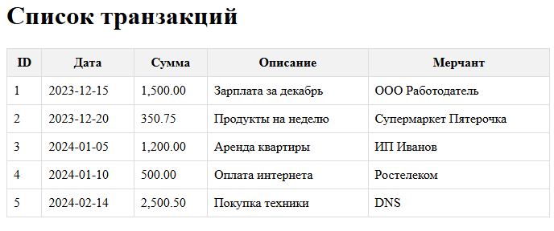
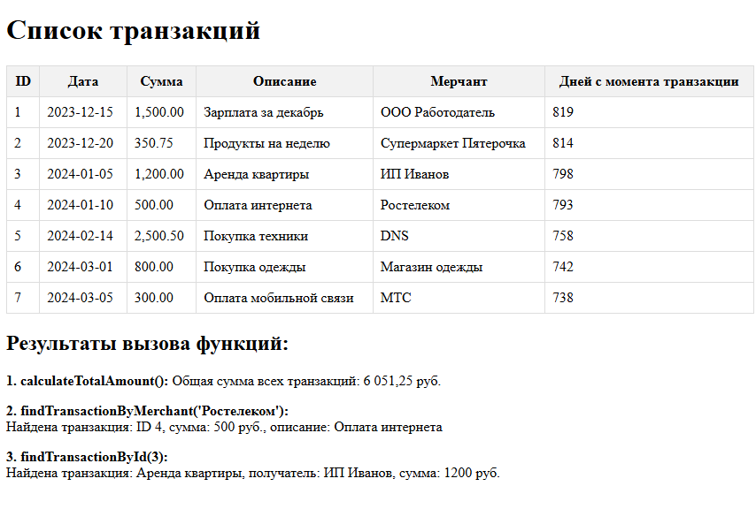

# Лабораторная работа №4. Массивы и Функции

## Цель работы
Освоить работу с массивами в PHP, применяя различные операции: создание, добавление, удаление, сортировка и поиск. Закрепить навыки работы с функциями, включая передачу аргументов, возвращаемые значения и анонимные функции.

# Задание 1. Работа с массивами

Создаю новый файл с базовым названием index.php

В нем я создам массив с различными транзакциями с полями, которые указаны  в условии лабораторной.

```php
<?php
declare(strict_types=1);

$transactions = [
    [
        "id" => 1,
        "date" => "2023-12-15",
        "amount" => 1500.00,
        "description" => "Зарплата за декабрь",
        "merchant" => "ООО Работодатель",
    ],
    [
        "id" => 2,
        "date" => "2023-12-20",
        "amount" => 350.75,
        "description" => "Продукты на неделю",
        "merchant" => "Супермаркет Пятерочка",
    ],
    [
        "id" => 3,
        "date" => "2024-01-05",
        "amount" => 1200.00,
        "description" => "Аренда квартиры",
        "merchant" => "ИП Иванов",
    ],
    [
        "id" => 4,
        "date" => "2024-01-10",
        "amount" => 500.00,
        "description" => "Оплата интернета",
        "merchant" => "Ростелеком",
    ],
    [
        "id" => 5,
        "date" => "2024-02-14",
        "amount" => 2500.50,
        "description" => "Покупка техники",
        "merchant" => "DNS",
    ],
];
?>
```

Я надеюсь 5 штук вполне хватит.

Далее требуется вывести с помощью foreach. В этом же файле написала код для отображения.

```html
<!DOCTYPE html>
<html lang="ru">
<head>
    <meta charset="UTF-8">
    <meta name="viewport" content="width=device-width, initial-scale=1.0">
    <title>Транзакции</title>
    <style>
        table {
            width: 100%;
            border-collapse: collapse;
        }
        th, td {
            border: 1px solid #ddd;
            padding: 8px;
        }
        th {
            background-color: #f2f2f2;
        }
    </style>
</head>
<body>
    <h1>Список транзакций</h1>
    <table>
        <thead>
            <tr>
                <th>ID</th>
                <th>Дата</th>
                <th>Сумма</th>
                <th>Описание</th>
                <th>Мерчант</th>
            </tr>
        </thead>
        <tbody>
            <?php foreach ($transactions as $transaction): ?>
                <tr>
                    <td><?= htmlspecialchars((string)$transaction['id']) ?></td>
                    <td><?= htmlspecialchars($transaction['date']) ?></td>
                    <td><?= htmlspecialchars(number_format($transaction['amount'], 2)) ?></td>
                    <td><?= htmlspecialchars($transaction['description']) ?></td>
                    <td><?= htmlspecialchars($transaction['merchant']) ?></td>
                </tr>
            <?php endforeach; ?>
        </tbody>
    </table>
</body>
</html>
```

Вывод:



Далее задание по реализации функций:

1. Общая сумма всех транзакций.
   
2. Транзакция по части описания.
   
3. Транзакция по идентификатору.
   
4. Кол-во дней между датой транзакции и текущим днем.
   
5. Добавление новой транзакции.

```php
/**
 * Вычисляет общую сумму всех транзакций
 */
function calculateTotalAmount(array $transactions): float
{
    $total = 0.0;
    foreach ($transactions as $transaction) {
        $total += $transaction['amount'];
    }
    return $total;
}

$totalAmount = calculateTotalAmount($transactions);

/**
 * Ищет транзакцию по названию мерчанта (получателя)
 */
function findTransactionByMerchant(array $transactions, string $merchant): ?array
{
    foreach ($transactions as $transaction) {
        if (strtolower($transaction['merchant']) === strtolower($merchant)) {
            return $transaction;
        }
    }
    return null;
}

$foundByMerchant = findTransactionByMerchant($transactions, "Ростелеком");

/**
 * Ищет транзакцию по ID
 */
function findTransactionById (int $id): ?array
{
    global $transactions;
    foreach ($transactions as $transaction) {
        if ($transaction['id'] === $id) {
            return $transaction;
        }
    }
    return null;
}

$foundById = findTransactionById(3);

/**
 * Вычисляет количество дней, прошедших с даты транзакции
 */
function daysSinceTransaction(string $date): int
{
    $transactionDate = new DateTime($date);
    $currentDate = new DateTime();
    $interval = $currentDate->diff($transactionDate);
    return (int)$interval->format('%a');
}

/**
 * Добавляет новую транзакцию в массив
 */
function addTransaction(int $id, string $date, float $amount, string $description, string $merchant): void
{
    global $transactions;
    $transactions[] = [
        "id" => $id,
        "date" => $date,
        "amount" => $amount,
        "description" => $description,
        "merchant" => $merchant,
    ];
}

addTransaction(6, "2024-03-01", 800.00, "Покупка одежды", "Магазин одежды");
addTransaction(7, "2024-03-05", 300.00, "Оплата мобильной связи", "МТС");
?>
```

И результат после обновления страницы:



И наконец делаем сортировку 

```php
$transactionsByDate = $transactions;  // для сортировки по дате
$transactionsByAmount = $transactions; // для сортировки по сумме

/**
 * Сортирует транзакции по дате (от новых к старым)
 */
usort($transactionsByDate, function($a, $b) {
    return strtotime($a['date']) - strtotime($b['date']);
});


/**
 * Сортирует транзакции по сумме (от большей к меньшей)
 */
usort($transactionsByAmount, function ($a, $b) {
    return $b['amount'] <=> $a['amount'];
});
```

## Задание 2. Работа с файловой системой

Я создала другой файл для удобства - index1.php

Вся работа с файлами заключается в этом блоке.

Обозначение директории, то бишь папки с картинками, пропуск пути к файлу и проверка является ли элемент файлом.

А все для того, чтобы вывести картинки.

И вау, мы даже не прописывали вставку каждой картинки из папки.
Это мега удобно.

```PHP
$dir = 'image/';
$files = scandir($dir);

if ($files === false) {
    die("Ошибка при чтении директории");
    return;
}   

for ($i = 0; $i < count($files); $i++)
    {
        // Пропускаем текущую и родительскую директории
        if ($files[$i] === '.' || $files[$i] === '..') {
            continue;
        }
        // Проверяем, является ли элемент файлом (а не директорией)
        if (is_dir($dir .'/'. $files[$i])) {
            continue;
        } else {
            echo '';
    }
    }
```

Получается такая прикольнаяя страничка:

